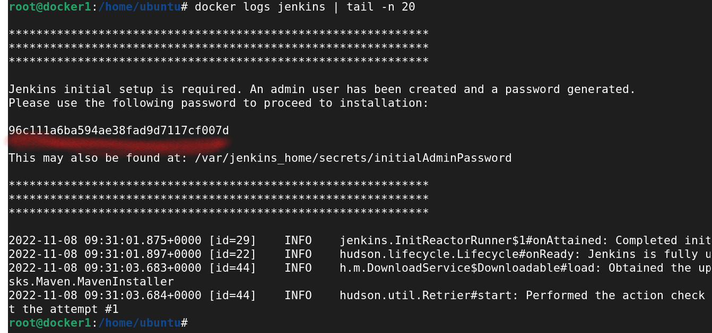
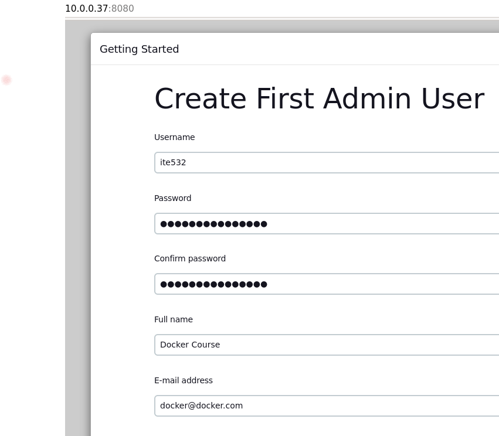

# JENKINS

Jenkins is a essential automation tool to setup Continuous Integration. Its the integrator which helps you build your development,  testing and deployment  workflow and create job pipelines. It also adds visibility to all stake holders including the Dev, QA, Ops teams involved in building, testing and deploying the product.

## Setting up Learning Environment with Docker
This is the easiest method to setup Jenkins and is a recommended option.  

### Installing Docker Engine

Proceed with installing Docker Engine on your choice of Operating System. For details on how to install docker visit the official installation page at  [docs.docker.com](https://docs.docker.com/engine/installation/).

We assume you have installed docker and are ready to launch containers before proceeding. To validate docker environment run.

```
docker ps
```

If the above command goes through without errors, you are all set.

After installing docker, pull our Jenkins docker image from [docker hub](https://hub.docker.com/_/jenkins/).

This is the simplest way of installing Jenkins and requires minimal efforts.

```
docker run -idt --name jenkins -v jenkins_home:/var/jenkins_home  -v /var/run/docker.sock:/var/run/docker.sock  -p 8080:8080 -p 50000:50000 jenkins/jenkins:slim
```

If you install it using the instructions above, find out the IP address and go to http://YOUR_IP_ADDRESS:8080 to access jenkins UI.

After some time initialising the instance, you will be prompted for the password.

At the console, you can get the password by typing,

```
docker logs jenkins | tail -n 20
```

Which will display the password to proceed with the installation:



After that you have to select to install with suggested plugins. 

When complete you will be asked for an admin user and password,




Now we have successfully installed Jenkins and we can proceed with configurations


-----

:point_right: [**Next** Chapter 3: Configure Jenkins](030_configure_jenkins.md)
