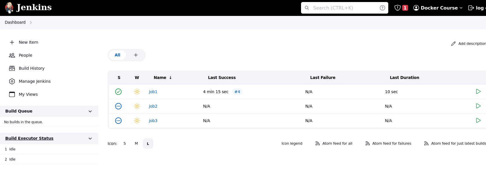

# Building Jobs Pipeline

## Creating More Jobs to add to pipeline

Lets create 2 more jobs so that we can connect those together to setup a mock build pipeline.

To create new jobs click on create items, name the job and select the last option which says **Copy from Another Job**.


For this tutorial, let's create jobs by name **job2** and **job3** which should be copies of job1.



At the end of this exercise, you should see 3 jobs listed on jenkins dashboard as above. While creating Job2 and Job3 for the first time, do not use any build triggers. We will update the configurations while defining upstream/downstream.

## Connecting jobs

Let's now create a pipeline by connecting these jobs together. We would create a pipeline with

```
job1 => job2 => job3
```

Where, job2 should run, only if job1 is built successfully, and should trigger job3 once it builds itself successfully. We can either define both connections from job2, or go to job1 and job3 and define its relationship with job2.  We will do the latter.

Open Job1 configurations and from **Post Build Actions** select **Build Other Projects** and select **job2**.


Go to jobs3 and define a dependency on job2. To do so scroll to **Build Triggers** section and select **Build after other projects are built** and provide job2.


## Upstreams and Downstreams

Jenkins calls these connections **Upstreams** and **Downstreams**. In the context of job1, downstream is job2 and for job2, job1 is upstream. Same goes with job2 and job3.  This is depicted in the following image which shows the job2 configurations.

----
:point_left:[**Prev** Chapter 5: Adding Build Triggers ](050_add_build_triggers.md)

:point_right: [**Next** Chapter 7: Preparing to build Java  Projects](070_preparing_for_java_builds.md)
